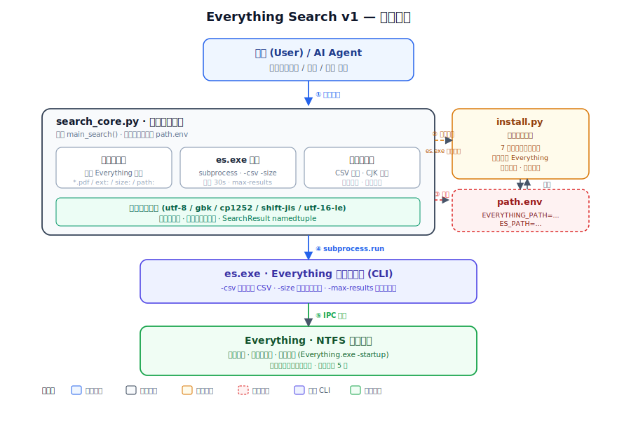
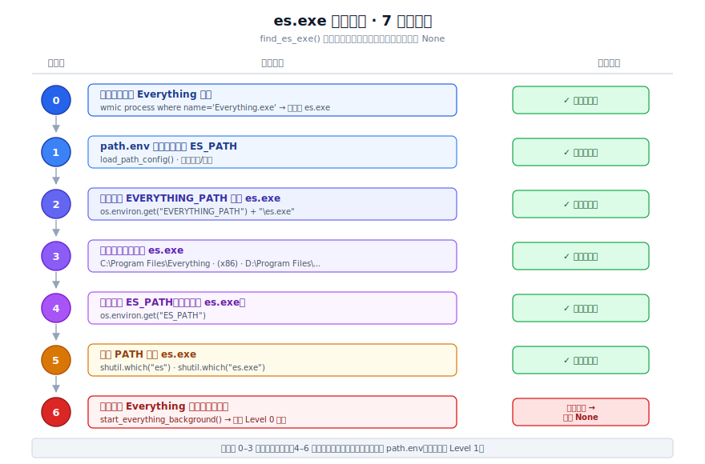

<div align="center">

# 🔎 Everything Search v1

**Windows 10/11 & WSL2 本地文件极速检索系统 · 节省 Token 消耗的 Skill**

**Everything Search v1** 是 一个 基于 [Everything](https://www.voidtools.com/)  命令行工具`es.exe`的, 旨在 智能体（Agent） 和用户（User）本地搜索提速，降低词元（Token）消耗的，面向 智能体Agent（如 OpenClaw、Hermes Agent、Reasonix等）与 终端用户的，将"搜索/查找/定位文件"这类高频操作从大模型（LLMs）直接调用转移到本地即时索引的 技能（Skill）。


[](https://www.python.org/)
[](https://www.voidtools.com/zh-cn/downloads/#cli)
[](#-许可证)


</div>

---

**中文 | [English](README_en.md)**

---

## 📖 目录

- [✨ 核心特性](#-核心特性)
- [📦 前置条件](#-前置条件)
- [🚀 安装与配置](#-安装与配置)
- [💻 使用方式与调用示例](#-使用方式与调用示例)
- [📋 输出格式示例](#-输出格式示例)
- [🎯 适用场景](#-适用场景)
- [🏗️ 系统架构](#️-系统架构)
- [🔄 搜索全流程](#-搜索全流程)
- [🔍 路径发现机制](#-路径发现机制)
- [📁 项目结构](#-项目结构)
- [⚠️ 注意事项](#️-注意事项)
- [❓ 常见问题](#-常见问题)
- [📚 参考资料](#-参考资料)
- [📄 许可证](#-许可证)

---

## ✨ 核心特性

| 特性 | 说明 |
| --- | --- |
| ⚡ **极速搜索** | 基于 Everything 的 NTFS 即时索引，毫秒级响应，扫描全盘文件名近乎零延迟 |
| 🪙 **词元友好** | 本地工具搜索代替大模型直接检索，显著降低 Token 消耗与调用成本 |
| 🧩 **多维索引** | 支持按文件名、扩展名、文件大小、完整路径等维度检索 |
| 👀 **人类可读输出** | 自动转换大小单位（B / KB / MB / GB / TB），表格对齐显示 |
| 🀄 **中文编码支持** | 多编码自动检测（utf-8 / gbk / cp1252 / shift-jis / utf-16-le），纠正中文路径乱码 |
| 📏 **CJK 宽度对齐** | 按终端显示宽度精确对齐，中英文混排表格整齐美观 |
| 🔒 **纯搜索模式** | 默认不存储文件索引信息，也不上传云端，保护用户隐私 |
| 🤖 **自动发现** | 7 级优先级自动检测 Everything 安装位置与 `es.exe` 路径 |
| 🛠️ **后台自愈** | Everything 未运行时自动后台启动并重试，`es.exe` 缺失时自动触发配置 |
| 🐧 **兼容 WSL2** | 同时支持 Windows 原生环境与 WSL2 子系统调用宿主 Everything |

---

## 📦 前置条件

在安装与使用本 Skill 前，请确认满足以下条件：

| 依赖项 | 要求 | 获取方式 |
| --- | --- | --- |
| **操作系统** | Windows 10 / 11 或 WSL2 | — |
| **Python** | 3.6 及以上 | [python.org](https://www.python.org/downloads/) |
| **Everything** | 已安装并至少运行过一次（建立索引） | [voidtools.com 下载](https://www.voidtools.com/zh-cn/downloads/) |
| **es.exe** | 需放置在 Everything 安装目录下 | [voidtools.com CLI 下载](https://www.voidtools.com/zh-cn/downloads/#cli) |

### es.exe 安装说明

1. 前往 [Everything CLI 下载页](https://www.voidtools.com/zh-cn/downloads/#cli)，根据系统架构选择 **ES-1.1.0.x86.x64.zip**（推荐 64 位）或对应 ARM 版本
2. 解压后，将 `es.exe` 移动至 Everything 的安装目录（默认为 `C:\Program Files\Everything\`），与 `Everything.exe` 同级
3. 首次运行 Everything 使其完成全盘索引（通常数秒内完成）

> ⚠️ `es.exe` 必须与 `Everything.exe` 位于同一目录，否则路径发现机制无法通过进程检测（Level 0）定位
> ⚠️  当然，您也可以安装Exerything1.5测试版本。 它自带了es.exe, 可以省去安装es.exe的麻烦

---

## 🚀 安装与配置

> 💡 **提示**：本 Skill 运行仅需以下文件：（选用作者推荐的安装方式时会排除 📄 文档资源 + 🧪 开发/测试 ）
>
> | 必需文件 | 用途 |
> | --- | --- |
> | `SKILL.md` | Skill 描述（Agent 识别入口） |
> | `scripts/install.py` | 安装发现脚本 |
> | `scripts/search_core.py` | 核心搜索脚本 |
> | `path.env` | 路径配置（首次运行 install.py 自动生成，**不在 Git 仓库中**） |
>
> **安装时默认排除**（📄 文档资源 + 🧪 开发/测试）：
> - `README.md`、`README_en.md` — 中英文发布页
> - `LICENSE` — MIT 许可证
> - `docs/` — 架构图 / 流程图 / 配图
> - `.gitignore`、`pytest.ini`、`requirements-dev.txt`、`tests/` — Git 配置与测试套件

### 方式一：自动安装（推荐：用智能体Agent安装）

将本 项目仓库地址 或 README 文件直接发送给你的 AI Agent，让其自动完成安装：

```text
请帮我安装并学习使用 everything-search-v1 这个 Skill，仓库地址：
https://github.com/1TOKENer/everything-search-skill（只需 SKILL.md + scripts/ 目录即可）
```

Agent 将自动执行克隆、路径探测与配置验证流程。**如 Agent 克隆了完整仓库**，可在完成后自行删除用不到的文件以保持工作目录精简。

### 方式二：手动安装

**方案 A — 精简克隆（推荐）**：仅拉取 ✅ 核心运行文件，不下载 📄 文档和 🧪 测试：

```bash
git clone --no-checkout https://github.com/1TOKENer/everything-search-skill.git \
  && cd everything-search-skill \
  && git sparse-checkout set SKILL.md scripts \
  && git checkout

# 首次配置（自动探测 Everything & es.exe 路径）
python scripts/install.py
```

**方案 B — 完整克隆后清理**：克隆全部文件，再手动删除非必需内容：

```bash
git clone https://github.com/1TOKENer/everything-search-skill.git \
  && cd everything-search-skill

# （可选）删除非运行文件，保持目录精简
rm -rf docs tests .gitignore pytest.ini requirements-dev.txt README.md README_en.md LICENSE

# 首次配置
python scripts/install.py
```

运行 `install.py` 后，脚本将自动探测 Everything 与 `es.exe` 的安装位置，并将路径写入 `path.env`。配置成功后可看到如下输出：

```text
============================================================
  Everything Search v1 - 安装配置工具
============================================================

  ✅ Everything.exe 存在: C:\Program Files\Everything\Everything.exe
  ✅ es.exe 存在: C:\Program Files\Everything\es.exe
  ✅ es.exe 可正常运行
  ✅ 路径配置已保存到: ...\path.env

============================================================
  🎉 配置完成！
============================================================
```

---

## 💻 使用方式与调用示例

### 1. 在 智能体（Agent）中触发搜索

在你的 Agent 对话中，使用包含触发词（搜索 / 查找 / 定位 文件）的自然语言即可：

```text
使用 everything-search-v1 技能，搜索本地文件 "陈绮贞 - 鱼"
```

```text
使用 everything-search-v1 技能，在电脑本地找一下文件 邓紫棋的歌
```

```text
使用 everything-search-v1 技能，帮我找一下所有大于 100MB 的 PDF 文件
```

### 2. 使用命令行直接调用（注意search_core.py脚本路径）

```bash
# 基础用法
python scripts/search_core.py "陈绮贞 - 鱼"

# 指定最大返回结果数（默认 100）
python scripts/search_core.py "*.txt" 50
```

### 3. 支持的搜索语法（Everything 语法）

`search_core.py` 原样将搜索词传入 `es.exe`，完整支持 Everything 搜索语法：

| 语法 | 示例 | 说明 |
| --- | --- | --- |
| 通配符 | `*.pdf` | 搜索所有 PDF 文件 |
| 关键词 | `report` | 搜索文件名包含 "report" 的文件 |
| 扩展名 | `ext:docx;pdf` | 搜索指定扩展名（多个用分号分隔） |
| 文件大小 | `size:>100mb` | 搜索大于 100MB 的文件 |
| 指定路径 | `path:C:\Users` | 在指定路径下搜索 |
| 组合查询 | `*.docx path:D:\Work size:<10mb` | 多条件组合 |

> 📖 更多语法请参考 [Everything 搜索语法官方文档](https://www.voidtools.com/support/everything/searching/)。

---

## 📋 输出格式示例

搜索结果表格形式展示，自动按 CJK 显示宽度对齐，文件大小优先以 TB/GB/MB/KB/B 为单位换算，更易读：

```text
🔎 搜索: *.flac
📊 找到 3 个结果

文件名                              扩展名    大小       路径
---------------------------------------------------------------------------
陈绮贞 - 鱼                         .flac     2.3 MB     C:\Music\陈绮贞 - 鱼.flac
陈绮贞 - 家                         .flac     15.7 MB    D:\Music\陈绮贞 - 家.flac
陈绮贞 - Self                       .flac     12.5 KB    C:\Desktop\陈绮贞 - Self.flac
```

**字段说明：**

| 字段 | 说明 |
| --- | --- |
| 文件名 | 文件名（含扩展名），过长自动截断并以 `..` 标识 |
| 扩展名 | 含点号的扩展名（如 `.pdf`） |
| 大小 | 自动换算的人类可读格式，无效值显示 `N/A` |
| 路径 | 文件完整路径，过长自动截断 |

---

## 🎯 适用场景

### ✅ 现适用于

- 📂 **文件名/路径检索** — 按文件名、扩展名、大小、路径定位本地文件
- 🤖 **Agent 辅助检索** — 让 AI Agent 调用本地工具代替直接检索，节省 Token
- 🎵 **媒体文件定位** — 查找音乐、视频、图片等本地资源
- 📑 **文档快速查找** — 在海量文档中按名称/类型/体积筛选
- 🗂️ **重复/大文件排查** — 配合 `size:` 语法定位占用空间的文件

### ❌ 暂不适用

- 🌐 **网页搜索** — 本 Skill 暂仅限本地文件系统检索
- 📝 **全文内容搜索** — 暂不支持搜索文件内部文本/代码内容（如"第 N 行包含 X"）
- 🍎 **非 Windows 平台** — 依赖于Everything，目前只支持 Windows 10/11 与 WSL2（Linux & macOS正在开发中...）
- 🎶 **同一搜索** — 如 电脑里只有名为陈绮贞的歌曲，但搜索CheerChen的歌曲（未来会支持）
---

## 🏗️ 系统架构

系统采用三层分层设计：
**调用层**（用户/Agent）→ **核心层**（`search_core.py`）→ **基础设施层**（`es.exe` + Everything 进程）
并由 `install.py` & `path.env` 提供配置 与 错误处理自愈支持 。

<p align="center">
  
</p>

**组件职责简要说明：**

- **`search_core.py`** — 执行核心搜索的脚本。提取、处理关键词，调用`es.exe` ，纠正中文编码并表格化输出搜索结果。
- **`install.py`** — 安装、发现 Everything & es.exe 的脚本。提供 7 级优先级路径发现，会将Everything 后台启动，将Everything & es.exe 位置路径写入 `path.env`。
- **`path.env`** — 路径配置文件（由 `install.py` 自动生成/更新，最好不要手动编辑）。存储 Everything & es.exe 位置路径
- **`es.exe`** — [“让用户在命令提示符中使用 Everything 搜索的命令行接口”（Everything CLI）。使用需正确版本的Everything进程运行。](https://www.voidtools.com/zh-cn/support/everything/command_line_interface/)
- **Everything** — [“Windows 上一款搜索引擎，它能够基于文件名快速定文件和文件夹位置。不像 Windows 内置搜索，"Everything"默认显示电脑上每个文件和文件夹 (就如其名 "Everything")。您在搜索框输入的关键词将会筛选显示的文件和文件夹。”](https://www.voidtools.com/zh-cn/faq/#everything_%E6%98%AF%E4%BB%80%E4%B9%88%EF%BC%9F)
---

## 🔄 搜索全流程

当用户或 Agent 触发搜索时，系统按"**搜索 → 判断 → 成功输出 / 报错处理自愈**"的顺序执行。下图以「小黑在井口垂钓」为隐喻，直观呈现主路径与四级自愈层级。

**流程要点：**

1. **主路径（a→b→c→d）** 由 `search_core.py` 处理：提取关键词 → 调用 `es.exe` → 处理编码/解析 → 表格输出。
2. **报错处理自愈（1→2→3→4）** 由 `install.py` 处理：
   - **① Everything 未运行** → 后台启动并重试
   - **② `es.exe` 不存在** → 运行 `install.py` 探测并保存路径，重试
   - **③ `es.exe` 版本/位置异常** → 引导用户前往官网下载正确版本
   - **④ 仍失败** → 需人工介入，并提供官方参考资料

---

## 🔍 路径发现机制

`find_es_exe()` 采用 **7 级优先级**策略定位 `es.exe`，依次尝试直至命中。该机制保证在多种安装方式（默认安装、自定义path路径、环境变量、PATH 注册等）下均能自动适配，无需用户手动配置。

<p align="center">
  
</p>

> 💡 **说明**：优先级 0–3 为常用命中路径；4–6 为补充兜底。配置成功后路径写入 `path.env`，后续调用直接命中 Level 1，减少重复探测，加速本地搜索。

---

## 📁 项目结构

```text
everything-search-skill/
│
├─ ✅ SKILL.md                       # Skill 描述文件（Agent 识别入口）
├─ ✅ scripts/
│   ├─ ✅ install.py                 # 安装发现脚本（路径发现 · 后台启动 · 配置路径）
│   └─ ✅ search_core.py             # 核心搜索脚本（关键词提取 · es.exe 调用 · 结果格式化）
│
├─ 📄 README.md                      # 中文发布页
├─ 📄 README_en.md                   # 英文发布页
├─ 📄 LICENSE                        # MIT 许可证
├─ 📄 docs/                          # 文档资源（架构图 · 流程图 · 配图）
│   ├─ architecture.svg              #   系统架构图（中文）
│   ├─ architecture_en.svg           #   系统架构图（英文）
│   ├─ search-flow-xiaohei.png       #   搜索全流程 Ian 小黑配图（正文主图）
│   ├─ search-flow-xiaohei_en.png    #   搜索全流程 Ian 小黑配图（英文）
│   ├─ discovery-priority.svg        #   路径发现优先级图（中文）
│   └─ discovery-priority_en.svg     #   路径发现优先级图（英文）
│
├─ 🧪 .gitignore                     # Git 忽略规则
├─ 🧪 pytest.ini                     # pytest 测试配置
├─ 🧪 requirements-dev.txt           # 开发依赖（pytest + pytest-cov）
├─ 🧪 tests/                         # 单元测试套件（129 个用例，覆盖率 67%）
│   ├─ __init__.py
│   ├─ conftest.py                   #   共享 fixtures（sys.path 配置、tmp_path 隔离）
│   ├─ test_install.py               #   install.py 测试（路径发现 · 配置管理 · 进程检测）
│   └─ test_search_core.py           #   search_core.py 测试（编码解码 · CSV 解析 · 表格格式化）
│
└─ 📦 path.env                       # 路径配置（首次运行 install.py 时自动生成，不在仓库中）
```

> **图例说明：**
> | 标记 | 含义 | 是否参与运行 |
> | --- | --- | --- |
> | ✅ | 核心运行文件 | **是** — 作者推荐方案安装默认只安装这些 |
> | 📄 | 文档资源 | 否 — 仅供 GitHub 发布页展示 |
> | 🧪 | 开发/测试 | 否 — 供贡献者使用 |


---

## ⚠️ 注意事项

1. **Everything 需运行** — `es.exe` 依赖 Everything 的 IPC 接口，搜索前 Everything 需处于运行中。本 Skill 会在检测到未运行时自动后台启动Everything（但仍建议您将Everything设为开机自启动）
2. **`es.exe` 位置！！！** — 必须与 `Everything.exe` 同目录，即Everything文件夹中，否则 Level 0 进程检测失效。若放置在其他目录，推荐您将它移入。（注：voidtools默认不会将es.exe加入PATH）

> ⚠️⚠️再说一遍，您也可以安装Exerything1.5测试版。它自带了es.exe, 可以省去es.exe位置的麻烦

3. **`path.env` 最好不要手动编辑** — 该文件由 `install.py` 自动管理。如需重置配置，直接删除该文件后重新运行 `install.py` 即可。（如果是高玩可以忽视这点）
4. **权限要求** — 访问部分目录（如系统目录`C:\Program Files`）下的文件可能需要读取权限；推荐：安装Everything时配置管理员权限可以获得更完整的索引覆盖。（以管理员身份运行 Everything 也行）
5. **WSL2 用户** — 需确保 Everything 安装在 Windows 宿主侧。（WSL2内会通过 `cmd.exe` 桥接调用 `tasklist` 与 Everything 可执行文件）
6. **隐私保护** — 本 Skill 默认为纯搜索模式，不存储任何文件索引或搜索历史；搜索结果仅在当前进程输出，不会上传云端。
7. **超时控制** — 单次搜索超时阈值为 30 秒，超时后返回错误提示，建议缩小搜索范围或减少 `max-results`。

---

## ❓ 常见问题

<details>
<summary><b>Q1：运行搜索时报错"es.exe 未找到"怎么办？</b></summary>

请按以下步骤排查：
1. 确认已下载 `es.exe` 并放置在 Everything 安装目录下（与 `Everything.exe` 同级）。

> ⚠️⚠️⚠️您也看看Exerything1.5测试版本。 它集成了es.exe, 可以省去es.exe配置带来的麻烦

2. 运行 `python scripts/install.py` 重新执行路径发现与配置。
3. 若仍失败，手动设置环境变量 `ES_PATH` 指向 `es.exe` 完整路径，或将 `es.exe` 所在目录加入系统 `PATH`。

</details>

<details>
<summary><b>Q2：搜索结果出现中文乱码？</b></summary>

本 Skill 已内置多编码自动检测（utf-8 / gbk / cp1252 / shift-jis / utf-16-le）。若仍出现乱码，通常是 `es.exe` 版本过旧或系统 locale 异常，建议升级至最新版 [es.exe](https://www.voidtools.com/zh-cn/downloads/#cli)。

</details>

<details>
<summary><b>Q3：搜索返回"Everything 未运行"但已启动？</b></summary>

可能是进程检测窗口（最多等待 5 秒）内 Everything 尚未完成初始化。请稍等片刻后重试，或将 Everything 设为开机自启以避免此问题。

</details>

<details>
<summary><b>Q4：如何重置配置？</b></summary>

删除项目根目录下的 `path.env` 文件，然后重新运行 `python scripts/install.py` 即可。

</details>

<details>
<summary><b>Q5：能否在 Linux/macOS 上使用？</b></summary>
暂不支持，还在开发中，请稍等哦~

</details>

---

## 📚 参考资料

- [ es.exe 界面 帮助信息](https://www.voidtools.com/zh-cn/support/everything/command_line_interface/)
- [ es.exe 命令行选项 帮助信息](https://www.voidtools.com/zh-cn/support/everything/command_line_options/)
- [Everything 所有搜索语法](https://www.voidtools.com/support/everything/searching/)
- [Everything 下载](https://www.voidtools.com/zh-cn/downloads/)
- [Everything es.exe 下载](https://www.voidtools.com/zh-cn/downloads/#cli)
- [Everything 更多帮助信息](https://www.voidtools.com/zh-cn/support/everything/)

---

## 📄 许可证

本项目基于 [MIT License](LICENSE) 开源，可自由使用、修改与分发。

Everything 和 `es.exe` 为 [voidtools](https://www.voidtools.com/) 的独立产品，其版权归原作者所有，使用时请遵循其相应许可协议。
OneToken已向作者授权使用 `es.exe` 作为本 Skill 的核心组件，并在此基础上进行功能封装与优化，感谢原作者的支持！！！！

配图使用到了[Ian Xiaohei Illustrations](https://github.com/helloianneo/ian-xiaohei-illustrations)这个skill,也请大家多多关注这个项目。

---

<div align="center">

**🔎 Everything Search v1** · 让Agent的本地文件检索回归毫秒级 · 让本地搜索不再是Token爆炸

Made with ❤️ by [OneToken](https://github.com/1TOKENer)

</div>
