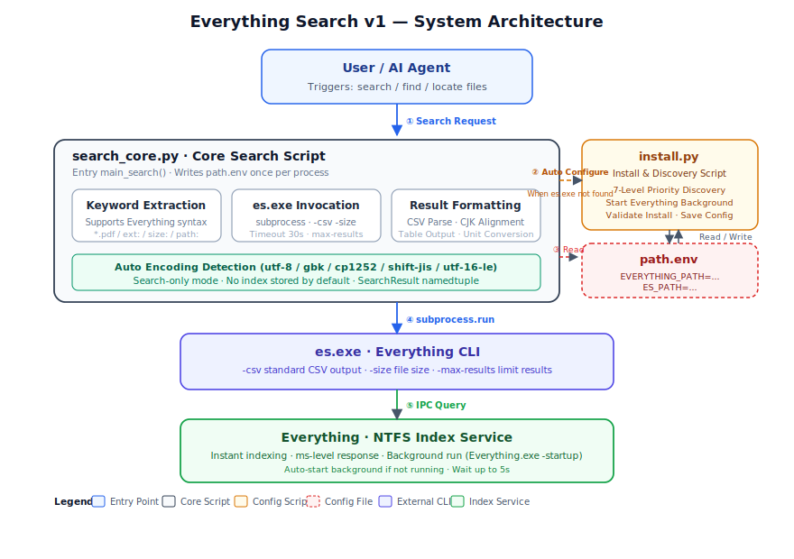
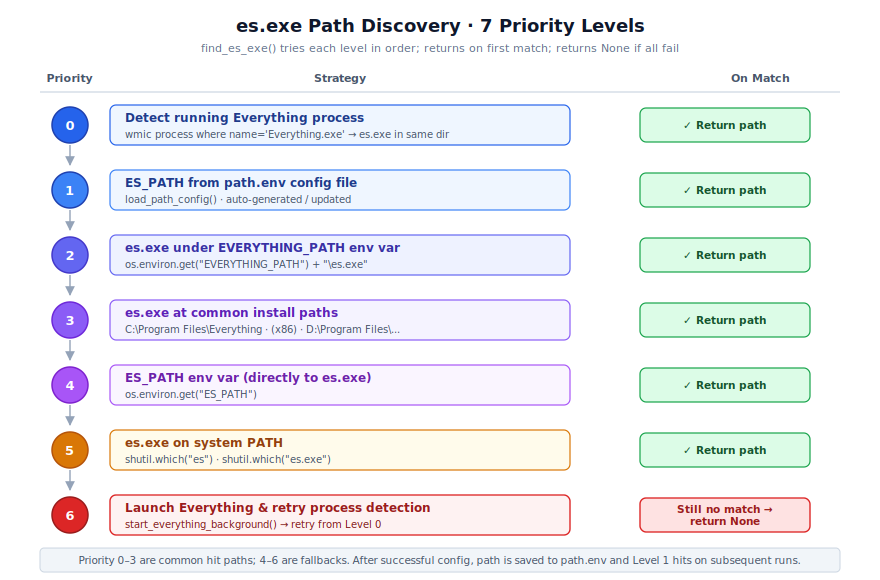

<div align="center">

# 🔎 Everything Search v1

**Lightning-Fast Local File Search for Windows 10/11 & WSL2 · A Token-Saving Skill**

**Everything Search v1** is a Skill built on top of the [Everything](https://www.voidtools.com/) command-line tool `es.exe`, designed to accelerate local file searches for both Agents (such as OpenClaw, Hermes Agent, Reasonix, etc.) and end users, reduce Token consumption, and offload high-frequency "search / find / locate file" operations from large language models (LLMs) to a local real-time index.


[](https://www.python.org/)
[](https://www.voidtools.com/zh-cn/downloads/#cli)
[](#-license)


</div>

---

[中文](README.md) | English

---

## 📖 Table of Contents

- [✨ Core Features](#-core-features)
- [📦 Prerequisites](#-prerequisites)
- [🚀 Installation & Configuration](#-installation--configuration)
- [💻 Usage & Examples](#-usage--examples)
- [📋 Output Format](#-output-format)
- [🎯 Use Cases](#-use-cases)
- [🏗️ System Architecture](#️-system-architecture)
- [🔄 Search Flow](#-search-flow)
- [🔍 Path Discovery Mechanism](#-path-discovery-mechanism)
- [📁 Project Structure](#-project-structure)
- [⚠️ Important Notes](#️-important-notes)
- [❓ FAQ](#-faq)
- [📚 References](#-references)
- [📄 License](#-license)

---

## ✨ Core Features

| Feature | Description |
| --- | --- |
| ⚡ **Blazing-Fast Search** | Leverages Everything's NTFS real-time index — millisecond response, near-zero latency when scanning filenames across all drives |
| 🪙 **Token-Friendly** | Local tool search replaces direct LLM retrieval, significantly reducing Token consumption and API costs |
| 🧩 **Multi-Dimensional Indexing** | Search by filename, extension, file size, full path, and more |
| 👀 **Human-Readable Output** | Auto-converts size units (B / KB / MB / GB / TB) with aligned table display |
| 🀄 **Chinese Encoding Support** | Multi-encoding auto-detection (utf-8 / gbk / cp1252 / shift-jis / utf-16-le), fixing garbled Chinese paths |
| 📏 **CJK Width Alignment** | Precisely aligns output by terminal display width for clean CJK-Latin mixed tables |
| 🔒 **Search-Only Mode** | No file index information is stored by default; nothing is uploaded to the cloud — protecting user privacy |
| 🤖 **Auto-Discovery** | 7-level priority detection of Everything installation location and `es.exe` path |
| 🛠️ **Background Self-Healing** | Automatically starts Everything in the background if not running, and triggers auto-configuration when `es.exe` is missing |
| 🐧 **WSL2 Compatible** | Supports both native Windows environments and WSL2 calling the host Everything installation |

---

## 📦 Prerequisites

Before installing and using this Skill, please ensure the following:

| Dependency | Requirement | How to Obtain |
| --- | --- | --- |
| **Operating System** | Windows 10 / 11 or WSL2 | — |
| **Python** | 3.6 or higher | [python.org](https://www.python.org/downloads/) |
| **Everything** | Installed and run at least once (to build the index) | [voidtools.com download](https://www.voidtools.com/zh-cn/downloads/) |
| **es.exe** | Must be placed in the Everything installation directory | [voidtools.com CLI download](https://www.voidtools.com/zh-cn/downloads/#cli) |

### es.exe Installation Guide

1. Go to the [Everything CLI download page](https://www.voidtools.com/zh-cn/downloads/#cli) and choose **ES-1.1.0.x86.x64.zip** (recommended: 64-bit) or the corresponding ARM version based on your system architecture
2. After extracting, move `es.exe` into the Everything installation directory (default: `C:\Program Files\Everything\`), alongside `Everything.exe`
3. Run Everything for the first time to let it complete the full-disk index (usually finished within seconds)

> ⚠️ `es.exe` must be in the same directory as `Everything.exe`, otherwise the path discovery mechanism cannot locate it via process detection (Level 0)
> ⚠️ Alternatively, you can install the Everything 1.5 beta version, which comes bundled with `es.exe` — saving you the trouble of configuring `es.exe` separately

---

## 🚀 Installation & Configuration

> 💡 **Tip**: This Skill only requires the following files to run：（📄 Documentation + 🧪 Dev/Testing will be excluded during recommended installation）
>
> | Required Files | Purpose |
> | --- | --- |
> | `SKILL.md` | Skill description (Agent recognition entry point) |
> | `scripts/install.py` | Installation & discovery script |
> | `scripts/search_core.py` | Core search script |
> | `path.env` | Path configuration (auto-generated on first run of install.py — **not in the Git repo**) |
>
> **Excluded by default during installation** (📄 Documentation + 🧪 Dev/Testing):
> - `README.md`, `README_en.md` — Chinese & English release pages
> - `LICENSE` — MIT License
> - `docs/` — Architecture diagrams / flowcharts / illustrations
> - `.gitignore`, `pytest.ini`, `requirements-dev.txt`, `tests/` — Git config & test suite

### Method 1: Automatic Installation (Recommended — via AI Agent)

Send the project repository URL or the README file directly to your AI Agent and have it complete the installation automatically:

```text
Please help me install and learn to use the everything-search-v1 Skill. Repo URL:
https://github.com/1Tokener/everything-search-skill (only SKILL.md + scripts/ directory needed)
```

The Agent will automatically clone the repo, detect paths, and verify the configuration. **If the Agent cloned the full repository**, you can delete the `docs/` folder, `README.md`, and `README_en.md` afterwards to keep the working directory lean.

### Method 2: Manual Installation

**Option A — Sparse clone (recommended)**: Fetch only ✅ core runtime files, skipping 📄 docs and 🧪 tests:

```bash
git clone --no-checkout https://github.com/1Tokener/everything-search-skill.git \
  && cd everything-search-skill \
  && git sparse-checkout set SKILL.md scripts \
  && git checkout

# First-time configuration (auto-detects Everything & es.exe paths)
python scripts/install.py
```

**Option B — Full clone then clean up**: Clone everything, then optionally remove non-runtime files:

```bash
git clone https://github.com/1Tokener/everything-search-skill.git \
  && cd everything-search-skill

# (Optional) Remove non-runtime files to keep the directory lean
rm -rf docs tests .gitignore pytest.ini requirements-dev.txt README.md README_en.md LICENSE

# First-time configuration
python scripts/install.py
```

After running `install.py`, the script will automatically detect the installation locations of Everything and `es.exe`, and write the paths to `path.env`. A successful configuration will show:

```text
============================================================
  Everything Search v1 - Installation & Configuration Tool
============================================================

  ✅ Everything.exe found: C:\Program Files\Everything\Everything.exe
  ✅ es.exe found: C:\Program Files\Everything\es.exe
  ✅ es.exe runs correctly
  ✅ Path configuration saved to: ...\path.env

============================================================
  🎉 Configuration complete!
============================================================
```

---

## 💻 Usage & Examples

### 1. Triggering a Search from an Agent

In your Agent conversation, simply use natural language containing trigger words (search / find / locate a file):

```text
Use the everything-search-v1 skill to search for the local file "Cheer Chen - Fish"
```

```text
Use the everything-search-v1 skill to find G.E.M. songs on this computer
```

```text
Use the everything-search-v1 skill to find all PDF files larger than 100 MB
```

### 2. Direct CLI Invocation (note the search_core.py script path)

```bash
# Basic usage
python scripts/search_core.py "Cheer Chen - Fish"

# Specify maximum number of results (default: 100)
python scripts/search_core.py "*.txt" 50
```

### 3. Supported Search Syntax (Everything Syntax)

`search_core.py` passes the search term directly to `es.exe`, fully supporting the Everything search syntax:

| Syntax | Example | Description |
| --- | --- | --- |
| Wildcard | `*.pdf` | Search for all PDF files |
| Keyword | `report` | Search for files whose names contain "report" |
| Extension | `ext:docx;pdf` | Search for specified extensions (separate multiple with semicolons) |
| File size | `size:>100mb` | Search for files larger than 100 MB |
| Path | `path:C:\Users` | Search within a specified path |
| Combined query | `*.docx path:D:\Work size:<10mb` | Combine multiple conditions |

> 📖 For more syntax details, refer to the [Everything Search Syntax Documentation](https://www.voidtools.com/support/everything/searching/).

---

## 📋 Output Format

Search results are displayed in a table, auto-aligned by CJK display width, with file sizes preferably converted to TB/GB/MB/KB/B for readability:

```text
🔎 Search: *.flac
📊 Found 3 results

File Name                           Extension  Size       Path
---------------------------------------------------------------------------
Cheer Chen - Fish                   .flac      2.3 MB     C:\Music\Cheer Chen - Fish.flac
Cheer Chen - Home                   .flac      15.7 MB    D:\Music\Cheer Chen - Home.flac
Cheer Chen - Self                   .flac      12.5 KB    C:\Desktop\Cheer Chen - Self.flac
```

**Field Descriptions:**

| Field | Description |
| --- | --- |
| File Name | File name (including extension); truncated with `..` if too long |
| Extension | Extension including the dot (e.g. `.pdf`) |
| Size | Auto-converted human-readable format; invalid values show `N/A` |
| Path | Full file path; truncated if too long |

---

## 🎯 Use Cases

### ✅ Currently Suitable For

- 📂 **Filename / Path Search** — Locate local files by filename, extension, size, or path
- 🤖 **Agent-Assisted Search** — Let AI Agents call local tools instead of searching directly, saving Tokens
- 🎵 **Media File Location** — Find local music, video, image, and other media resources
- 📑 **Quick Document Lookup** — Filter through massive document collections by name, type, or size
- 🗂️ **Duplicate / Large File Audit** — Use the `size:` syntax to locate space-hogging files

### ❌ Not Currently Suitable For

- 🌐 **Web Search** — This Skill is limited to local file system search only
- 📝 **Full-Text Content Search** — Does not yet support searching the internal text/code content of files (e.g. "line N contains X")
- 🍎 **Non-Windows Platforms** — Depends on Everything; currently supports Windows 10/11 and WSL2 only (Linux & macOS support in development...)
- 🎶 **Cross-Language Match** — e.g. files named with the Chinese artist name "陈绮贞" won't match an English search for "Cheer Chen" (planned for future support)

---

## 🏗️ System Architecture

The system uses a three-tier layered design:
**Invocation Layer** (User / Agent) → **Core Layer** (`search_core.py`) → **Infrastructure Layer** (`es.exe` + Everything process)
with `install.py` & `path.env` providing configuration and error-handling self-healing support.

<p align="center">
  
</p>

**Component Responsibilities at a Glance:**

- **`search_core.py`** — Core search script. Extracts and processes keywords, invokes `es.exe`, corrects Chinese encoding, and outputs results in table format.
- **`install.py`** — Installation & discovery script. Provides 7-level priority path discovery, starts Everything in the background if needed, and writes Everything & `es.exe` paths to `path.env`.
- **`path.env`** — Path configuration file (auto-generated / updated by `install.py`; manual editing is discouraged). Stores the Everything & `es.exe` file paths.
- **`es.exe`** — ["A command-line interface that allows users to search Everything from the command prompt" (Everything CLI). Requires the correct version of the Everything process to be running.](https://www.voidtools.com/support/everything/command_line_interface/)
- **Everything** — ["A search engine for Windows that can quickly locate files and folders by filename. Unlike Windows' built-in search, Everything displays every file and folder on your computer by default (hence the name 'Everything'). Keywords you enter in the search box filter the displayed files and folders."](https://www.voidtools.com/faq/#what_is_everything)

---

## 🔄 Search Flow

When a user or Agent triggers a search, the system executes in the order of "**Search → Evaluate → Success Output / Error Self-Healing**". The diagram below uses the metaphor of "fishing at the well's edge" to visually present the main path and four self-healing tiers.

**Flow Highlights:**

1. **Main Path (a→b→c→d)** is handled by `search_core.py`: Extract keywords → Invoke `es.exe` → Handle encoding / parse → Table output.
2. **Error Self-Healing (1→2→3→4)** is handled by `install.py`:
   - **① Everything not running** → Start in background and retry
   - **② `es.exe` not found** → Run `install.py` to detect and save path, then retry
   - **③ `es.exe` version / location anomaly** → Guide user to download the correct version from the official website
   - **④ Still failing** → Manual intervention required; official reference materials provided

---

## 🔍 Path Discovery Mechanism

`find_es_exe()` uses a **7-level priority** strategy to locate `es.exe`, trying each level in sequence until a match is found. This mechanism ensures automatic adaptation across various installation methods (default installation, custom paths, environment variables, PATH registration, etc.) without requiring manual configuration.

<p align="center">
  
</p>

> 💡 **Note**: Priority levels 0–3 are the most commonly hit paths; levels 4–6 serve as supplementary fallbacks. After successful configuration, the path is written to `path.env`, so subsequent invocations hit Level 1 directly, reducing redundant detection and accelerating local searches.

---

## 📁 Project Structure

```text
everything-search-skill/
│
├─ ✅ SKILL.md                       # Skill description file (Agent recognition entry point)
├─ ✅ scripts/
│   ├─ ✅ install.py                 # Installation & discovery script (path discovery · background startup · configure paths)
│   └─ ✅ search_core.py             # Core search script (keyword extraction · es.exe invocation · result formatting)
│
├─ 📄 README.md                      # Chinese release page
├─ 📄 README_en.md                   # English release page
├─ 📄 LICENSE                        # MIT License
├─ 📄 docs/                          # Documentation assets (architecture diagrams · flowcharts · illustrations)
│   ├─ architecture.svg              #   System architecture diagram (Chinese)
│   ├─ architecture_en.svg           #   System architecture diagram (English)
│   ├─ search-flow-xiaohei.png       #   Search flow "Ian Xiaohei" illustration (main article graphic)
│   ├─ search-flow-xiaohei_en.png    #   Search flow "Ian Xiaohei" illustration (English)
│   ├─ discovery-priority.svg        #   Path discovery priority diagram (Chinese)
│   └─ discovery-priority_en.svg     #   Path discovery priority diagram (English)
│
├─ 🧪 .gitignore                     # Git ignore rules
├─ 🧪 pytest.ini                     # pytest test configuration
├─ 🧪 requirements-dev.txt           # Development dependencies (pytest + pytest-cov)
├─ 🧪 tests/                         # Unit test suite (129 test cases, 67% coverage)
│   ├─ __init__.py
│   ├─ conftest.py                   #   Shared fixtures (sys.path setup, tmp_path isolation)
│   ├─ test_install.py               #   install.py tests (path discovery · config management · process detection)
│   └─ test_search_core.py           #   search_core.py tests (encoding decode · CSV parsing · table formatting)
│
└─ 📦 path.env                       # Path configuration (auto-generated on first run of install.py; not in the repo)
```

> **Legend:**
> | Marker | Meaning | Required at runtime? |
> | --- | --- | --- |
> | ✅ | Core runtime files | **Yes** —  recommended installation only includes these |
> | 📄 | Documentation | No — for GitHub release page display only. |
> | 🧪 | Development / testing | No — for contributors |


---

## ⚠️ Important Notes

1. **Everything must be running** — `es.exe` depends on Everything's IPC interface; Everything must be running before searching. This Skill will automatically start Everything in the background if it detects it's not running (however, it is still recommended to set Everything to auto-start on boot)
2. **`es.exe` location is critical!** — Must be in the same directory as `Everything.exe`, i.e. inside the Everything folder, otherwise Level 0 process detection will fail. If placed elsewhere, we recommend moving it in. (Note: voidtools does not add es.exe to PATH by default)

> ⚠️⚠️ Again, you can also install the Everything 1.5 beta version, which comes bundled with `es.exe` — saving you the `es.exe` location hassle

3. **Avoid manually editing `path.env`** — This file is automatically managed by `install.py`. To reset the configuration, simply delete this file and re-run `install.py`. (Power users may disregard this tip)
4. **Permission requirements** — Accessing files under certain directories (such as system directories like `C:\Program Files`) may require read permissions; recommendation: install Everything with administrator privileges for more complete index coverage. (Running Everything as administrator also works)
5. **WSL2 users** — Ensure Everything is installed on the Windows host side. (Inside WSL2, `tasklist` and Everything executables are called via `cmd.exe` bridging)
6. **Privacy protection** — This Skill operates in search-only mode by default; no file index or search history is stored; search results are only output in the current process and are never uploaded to the cloud.
7. **Timeout control** — A single search has a 30-second timeout threshold; an error message is returned if exceeded. We recommend narrowing the search scope or reducing `max-results`.

---

## ❓ FAQ

<details>
<summary><b>Q1: I get an "es.exe not found" error when searching. What should I do?</b></summary>

Please troubleshoot in the following order:
1. Confirm that `es.exe` has been downloaded and placed in the Everything installation directory (alongside `Everything.exe`).

> ⚠️⚠️⚠️ Also, check out the Everything 1.5 beta version. It integrates `es.exe`, sparing you the hassle of configuring `es.exe` separately.

2. Run `python scripts/install.py` to re-execute path discovery and configuration.
3. If it still fails, manually set the environment variable `ES_PATH` to point to the full path of `es.exe`, or add the directory containing `es.exe` to the system `PATH`.

</details>

<details>
<summary><b>Q2: Search results show garbled Chinese characters?</b></summary>

This Skill already has built-in multi-encoding auto-detection (utf-8 / gbk / cp1252 / shift-jis / utf-16-le). If garbled text still appears, it is usually due to an outdated `es.exe` version or an abnormal system locale. We recommend upgrading to the latest [es.exe](https://www.voidtools.com/zh-cn/downloads/#cli).

</details>

<details>
<summary><b>Q3: The search returns "Everything not running" even though it's already started?</b></summary>

Everything may not have finished initializing within the process detection window (up to 5 seconds). Please wait a moment and retry, or set Everything to auto-start on boot to avoid this issue.

</details>

<details>
<summary><b>Q4: How do I reset the configuration?</b></summary>

Delete the `path.env` file in the project root directory, then re-run `python scripts/install.py`.

</details>

<details>
<summary><b>Q5: Can I use this on Linux/macOS?</b></summary>

Not yet — still in development. Please stay tuned!

</details>

---

## 📚 References

- [Everything Command-Line Interface Help](https://www.voidtools.com/support/everything/command_line_interface/)
- [Everything Command-Line Options Help](https://www.voidtools.com/support/everything/command_line_options/)
- [Everything Search Syntax Reference](https://www.voidtools.com/support/everything/searching/)
- [Everything Download](https://www.voidtools.com/zh-cn/downloads/)
- [Everything es.exe Download](https://www.voidtools.com/zh-cn/downloads/#cli)
- [Everything More Help Resources](https://www.voidtools.com/support/everything/)

---

## 📄 License

This project is open-sourced under the [MIT License](LICENSE) and is free to use, modify, and distribute.

Everything and `es.exe` are independent products of [voidtools](https://www.voidtools.com/); their copyright belongs to the original author. Please follow their respective license agreements when using them.
OneToken has obtained authorization from the author to use `es.exe` as the core component of this Skill, and has built functional encapsulation and optimization on top of it. Many thanks to the original author for their support!

The illustrations were created using the [Ian Xiaohei Illustrations](https://github.com/helloianneo/ian-xiaohei-illustrations) skill — please check out that project as well!

---

<div align="center">

**🔎 Everything Search v1** · Bringing millisecond-level local file search to your Agent · No more Token explosions in local search

Made with ❤️ by [OneToken](https://github.com/1Tokener)

</div>
